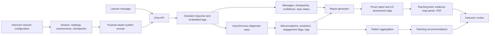

# Architecture Inventory

## Runtime And Framework

- Next.js 16.2.2 App Router
- React 19.2.4
- TypeScript 5
- Prisma 7.7.0
- SQLite locally; libSQL/Turso path for hosted environments
- Anthropic via both `@anthropic-ai/sdk` and Vercel AI SDK
- Tailwind CSS 4
- Puppeteer and `marked` for PDF export

The Next.js production build succeeds. Prisma reports that the `driverAdapters` preview flag is deprecated.

## User-Facing Routes

| Route | Audience | Purpose | Principal dependencies |
|---|---|---|---|
| `/` | Prospective instructor | Product explanation and entry CTA | Static copy |
| `/instructor` | Instructor | Create a learning session | `POST /api/sessions` |
| `/instructor/[sessionId]` | Instructor | Configure purpose, sources, questions, context, assessment protection, and learner link | Session, file, checkpoint, summary, and suggestion APIs |
| `/instructor/[sessionId]/monitor` | Instructor | Learner progress, live review signals, dialogue replay | Student summary/detail APIs |
| `/instructor/[sessionId]/analysis` | Instructor | Combined teaching brief, patterns, recommendations, outcome evidence, and roster | Report, pattern, recommendation, difficulty, and summary APIs |
| `/instructor/[sessionId]/misconceptions` | Instructor | Misunderstanding pattern review and overrides | Aggregate, override, recommendation, and difficulty APIs |
| `/instructor/[sessionId]/report` | Instructor | Teaching brief and PDF export | Report and session APIs |
| `/s/[accessCode]` | Learner | Session orientation and name entry | Server-side Prisma lookup; student-session API |
| `/s/[accessCode]/chat` | Learner | Guided AI_thena conversation and summary | Chat and end-session APIs |

## API Surface

| Endpoint | Methods | Purpose | Primary records |
|---|---|---|---|
| `/api/sessions` | POST | Create session and access code | `Session` |
| `/api/sessions/[sessionId]` | GET, PATCH | Read and update session | `Session` |
| `/api/sessions/[sessionId]/config` | PATCH | Update setup configuration | `Session` |
| `/api/sessions/[sessionId]/upload` | POST | Parse and store source or assessment file | `Reading`, `Assessment` |
| `/api/sessions/[sessionId]/files` | GET, DELETE | List or remove files | `Reading`, `Assessment` |
| `/api/sessions/[sessionId]/checkpoints` | GET, POST, DELETE | Manage evidence questions | `Checkpoint` |
| `/api/sessions/[sessionId]/checkpoints/[checkpointId]` | PATCH | Edit/reorder checkpoint | `Checkpoint` |
| `/api/sessions/[sessionId]/checkpoints/lint` | POST | AI critique of a question | No persisted result |
| `/api/sessions/[sessionId]/checkpoints/suggest` | POST | Generate and rank suggested questions | Response only |
| `/api/sessions/[sessionId]/checkpoints/difficulty` | GET | Aggregate checkpoint outcomes | `Checkpoint`, `StudentCheckpoint` |
| `/api/sessions/[sessionId]/suggest-prerequisite-map` | POST | Generate foundational concept map | Response; later stored on `Session` |
| `/api/student-sessions` | POST | Create learner participation record | `StudentSession` |
| `/api/chat` | POST | Stream conversation; persist messages; schedule diagnostics and state updates | Most learner evidence tables |
| `/api/end-session` | POST | Generate learner summary and close session | `StudentSession` |
| `/api/sessions/[sessionId]/students/summary` | GET | Monitor-table summaries and flags | `StudentSession`, `Message`, `Misconception`, `LOAssessment` |
| `/api/sessions/[sessionId]/students` | GET | Full learner dialogue and evidence detail | Learner-related tables |
| `/api/sessions/[sessionId]/misconceptions/aggregate` | GET | Cluster misunderstanding records and calculate statistics | `Misconception`, overrides, messages |
| `/api/sessions/[sessionId]/misconceptions/override` | GET, POST | Store cluster-level instructor override | `MisconceptionOverride` |
| `/api/sessions/[sessionId]/recommendations` | GET, POST | Generate and retrieve teaching recommendations | `TeachingRecommendation` |
| `/api/sessions/[sessionId]/recommendations/[recId]` | PATCH | Mark recommendation used/dismissed/edited | `TeachingRecommendation` |
| `/api/sessions/[sessionId]/report` | GET | Return or regenerate teaching brief and outcome tags | `Report`, `LOAssessment` |
| `/api/sessions/[sessionId]/report/export` | GET | Render latest report as PDF | `Report`, `Session` |

## Core Components

### Session Configuration

`session-workspace-panels.tsx` contains the principal instructor setup surfaces:

- Workspace header
- Status summary
- Learner link
- Purpose-aware session insights
- Source materials
- Evidence questions
- Purpose and outcomes
- Teaching context
- Interaction style and exchange settings
- Foundational concept map
- Protected assessment materials

### Learner Experience

- `student-entry-form.tsx`: creates the learner session and stores identifiers in browser session storage.
- `client-chat.tsx`: controls conversation state, progress, streaming, ending, and learner summary.
- `chat-area.tsx`, `message-bubble.tsx`, `chat-input.tsx`: render and collect dialogue.

### Instructor Evidence Experience

- `monitor/page.tsx`: learner-level live/snapshot signals and exchange replay.
- `misconceptions/page.tsx`: pattern aggregation, difficulty, recommendation generation, and overrides.
- `analysis/page.tsx`: combined quick brief and full analysis experience.
- `report/page.tsx`: teaching brief and outcome evidence.
- `LOAssessmentCard.tsx`: evidence-level display backed by `LOAssessment`.
- `readiness-heatmap.tsx`: parses prose report sections into evidence-map cards.
- `exchange-replay.tsx`: displays learner/assistant dialogue with detected evidence overlays.

## AI And Heuristic Pipeline

### Main Conversation

`system-prompt.ts` builds a purpose-aware Socratic prompt with:

- Source-only content rule
- Protected-assessment rule
- One-question-at-a-time behavior
- Direct error correction
- Hint ladder
- Confidence probes
- Checkpoint tags
- Question-type tags
- Purpose-specific targets
- Prerequisite checks
- Soft revisits
- Conversation-phase instructions

`/api/chat` streams the model response, parses embedded tags, stores messages, updates checkpoint/confidence state, runs diagnostics asynchronously, and updates topic status.

### Diagnostic Pass

`diagnostic.ts` sends a separate model request after an exchange. It emits structured JSON for:

- New misconceptions
- Resolved misconceptions
- Severity
- Confidence
- Engagement flag and note

The result is persisted to `Misconception`, `Message`, and `DiagnosticLog`.

### Confidence

Confidence is collected partly through prompted learner self-report and partly through phrase matching in `attempt-tracker.ts`. Phrase matching recognizes a small fixed English vocabulary.

### Topic Status

`mastery.ts` calculates `TopicMastery` from heuristic conditions such as substantive responses, question types, resolved misconceptions, direct answers, and confidence. Two criteria can produce a persisted `mastered` status.

### Learning Outcome Evidence

`report-generator.ts` asks the report model to emit prose and structured `LO_ASSESSMENT` tags. Those tags are parsed and persisted as `LOAssessment`. Evidence summaries are text, not first-class citations.

### Pattern Aggregation

The aggregate route groups misunderstanding records, optionally uses a model for semantic clustering, calculates prevalence/resolution/severity, and applies cluster-label overrides.

### Teaching Recommendations

The recommendation route converts clusters and session context into structured recommendations containing evidence strings and 5-, 15-, and 30-minute moves. Instructor actions are limited to used, dismissed, or edited plus an optional note.

## Persistence Model

### Configuration

- `Session`
- `Reading`
- `Assessment`
- `Checkpoint`
- `SuggestedQuestion`

### Learner Activity

- `StudentSession`
- `Message`
- `StudentCheckpoint`
- `ConfidenceCheck`

### Inferred Evidence

- `Misconception`
- `TopicMastery`
- `LOAssessment`
- `DiagnosticLog`

### Instructor Outputs And Overrides

- `Report`
- `MisconceptionOverride`
- `TeachingRecommendation`

### Structural Constraints

- Several structured values are stored as JSON strings: learning outcomes, prerequisite map, evidence notes, process metrics, criteria, recommendation evidence, moves, clusters, report stats, and queues.
- Reports are stored primarily as prose.
- There is no general evidence-signal entity or evidence-citation entity.
- There is no prompt/model version on evidence records.
- There is no general instructor review history.
- Prisma schema and a large handwritten Turso bootstrap SQL schema must remain synchronized manually.

## Principal Data Flow

## Authentication And Authorization Baseline

- No instructor account or authentication model is present.
- `Session` has no owner/instructor identifier.
- Learners provide a name but have no authenticated identity.
- Many APIs authorize solely through possession of `sessionId` or `studentSessionId`.
- Access codes gate learner entry but are not an instructor authorization boundary.
- File deletion verifies that a file belongs to the supplied session, but not that the caller owns the session.

This is a critical baseline risk for any real learner deployment.

## Export Baseline

- Learner summaries are generated as Markdown and stored on `StudentSession`.
- Instructor reports are stored as Markdown-like prose in `Report.content`.
- PDF export converts the latest report through `marked` and Puppeteer.
- Exports do not carry a complete evidence appendix, prompt version, model version, or instructor review status.

